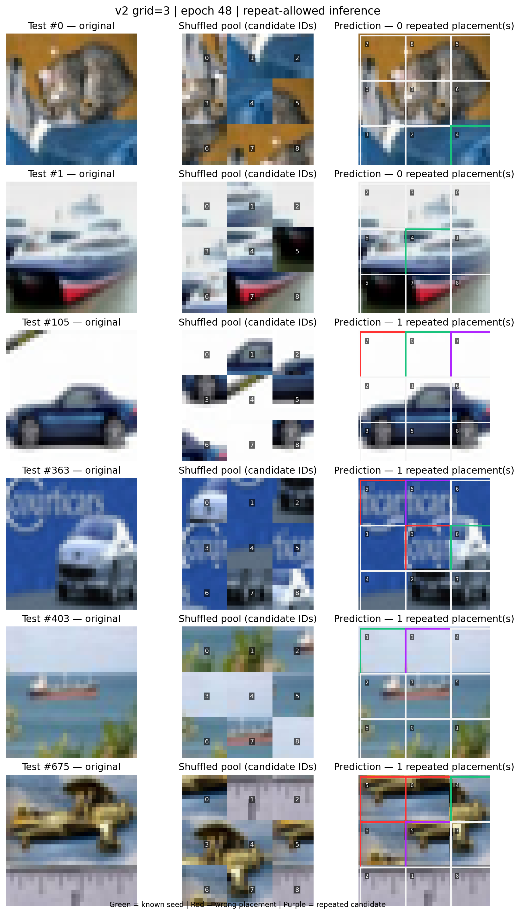

# CIFAR-10 单图拼图复原

一个用于研究小图像拼图恢复的 PyTorch 项目。每张 CIFAR-10 图像被切成网格块、打乱后交给模型；模型从一块已知真实位置的种子出发，逐步预测其余碎片的位置。

当前包含两个实现：

- **v1**：较早的局部与全局特征融合实现，使用 BFS 扩展。
- **v2**：重构后的训练与推理流程，支持 3×3、5×5、7×7 网格、BFS 或随机边界扩展、局部与全局注意力，以及逐步衰减的 teacher forcing。

在 v2 中，已知种子仅作为推理起点，不计入训练损失和非种子块准确率；正式推理默认禁止重复使用碎片。`solve` 和 `solve_batch` 也提供 `allow_repeats=True`，用于分析移除该推理约束后的变化，不代表模型经过了重复放置训练。

## 环境与数据

建议 Python 3.10 或更新版本。根据本机硬件安装匹配的 PyTorch 与 CUDA 版本，再安装其余依赖：

```bash
python -m venv .venv
source .venv/bin/activate
python -m pip install --upgrade pip
python -m pip install -r requirements.txt
```

准备 CIFAR-10 Python 版数据集，并解压到 `data/cifar10/`，使目录中包含 `cifar-10-batches-py/`。数据和模型检查点默认保存在本地，不纳入版本控制。

## v2 快速开始

在项目根目录训练 5×5 网格：

```bash
python -m v2.run_experiments \
  --grid-size 5 \
  --epochs 100 \
  --batch-size 64 \
  --strategy random_frontier \
  --data-dir ./data/cifar10 \
  --save-dir-prefix ./checkpoints/v2
```

评估已保存的检查点：

```bash
python -m v2.run_experiments \
  --eval-checkpoint ./checkpoints/v2/grid5/best.pt \
  --data-dir ./data/cifar10
```

更完整的配置、指标定义和运行命令见 [v2/README.md](v2/README.md)；v1 的说明见 [v1/README.md](v1/README.md)。

## 当前示例结果

`visualizations/` 中保留了 3×3 v2 的测试集拼图图像和指标 JSON，包括允许重复选块的推理消融示例。对应权重为训练过程中的 epoch 48 快照，测试设置及限制记录在 JSON 文件中。



## 测试

```bash
python -m pytest v1/tests v2/tests -q
```
